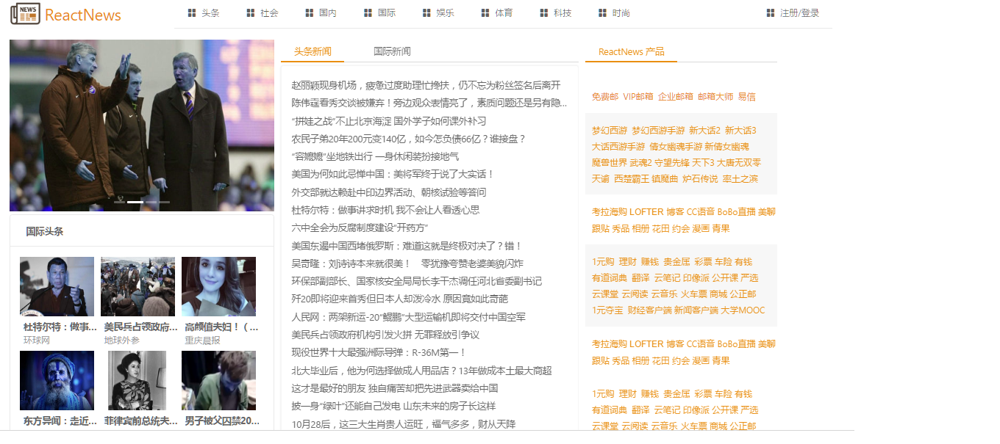
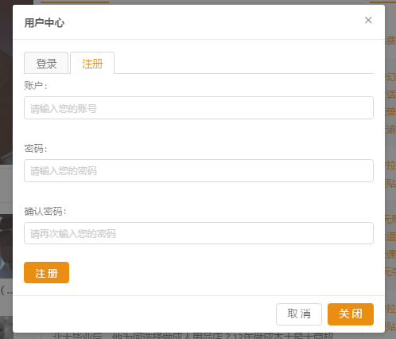
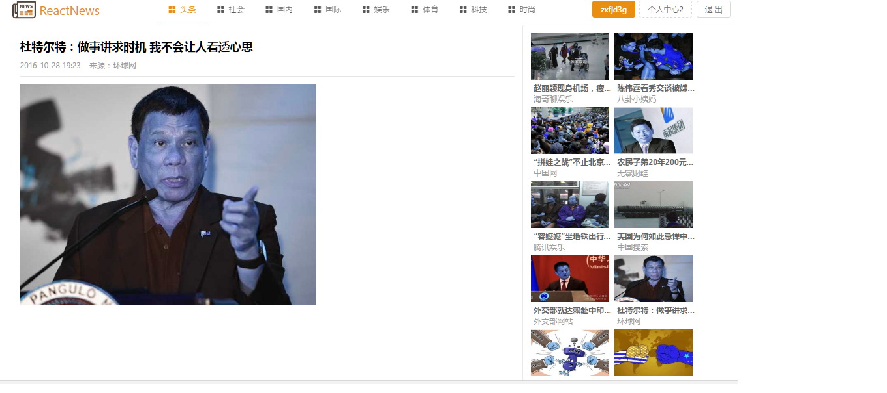
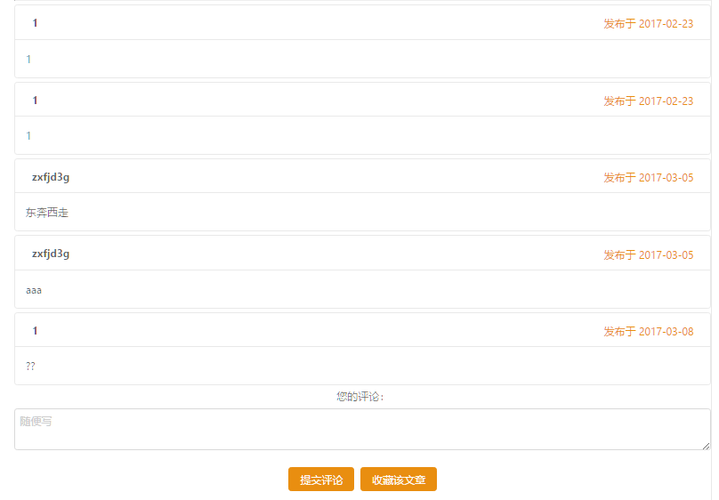
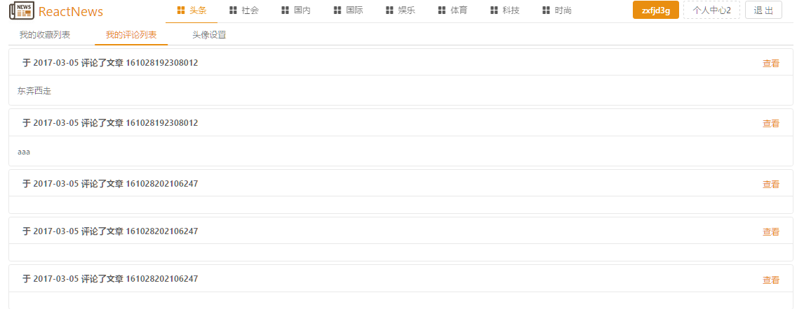

#新闻资讯 Web App
* ##  准备工作
	* ###项目描述
		* 此项目是一个新闻资讯的SPA Web APP
		* PC端、移动端双端适应
		* 功能模块主要包括：首页、新闻详情、新闻评论、用户中心、用户登录、注册等
		* 用户界面主要使用蚂蚁金服基于React的UI库 ：Ant Design
		* 项目采用模块化、组件化、工程化的模式开发
	* ###项目功能界面展示
		* 首页

		* 注册/登录

		* 新闻详情
 
		* 新闻评论

		* 个人中心

	* ###技术选型
		* 前台数据展现/交互/组件化 
			* React 的核心库react 和react-dom扩展库
			* react-router ： 实现SPA的路由库
			* antd  ： 基于React的UI库
		* 前后台交互
			* axios - ajax库，用于发送ajax请求
			* API接口
			* json 数据
			* postman ： 用于测试发送请求并接受相应数据
		* 模块化
			* ES6
			* babel
		* 项目化构建
			* webpack ： 项目构建打包
			* react-create-app ： 脚手架
			* eslint : 代码语法检查
	* ###前端路由
		* 首页 
			* 根路由 components/app.js
			* 首页默认路由 components/news_container.js
		* 新闻详情/评论
			* path ： "/detail/:uniquekey"
			* components/news_detail.js
		* 个人中心
			* path ："user_center"
			* components/user_center.js
	* ###API 接口
		* API接口主要包括
			* url
			* 请求方式
			* 请求参数的格式
			* 响应数据的格式
		* 接口文档 — 描述接口的文件具体的一些接口
		* mock数据 (模拟数据)   
	* ### React 组件
		* antd 组件主要包括
			* 常规组件 (如Button按钮、Icon图标)
			* 布局   (如行Row、列Col)
			* 导航   (如页签Tabs、菜单Menu、回到顶部BackTop)
			* 数据实体 (如Form表单、Input输入框、Upload上传)
			* 数据显示  (如卡片Card、轮播图Carousel)
			* 反馈   (如对话框Modal、通知提醒框notification、提示消息message)  
		* 自定义组件
			* app.js
			* news_header.js
			* news_footer.js
			* 子路由组件
				* news_container.js
				* news_detail.js
				* user_center.js
* ##应用开发
	* 启动项目
		* 搭建项目 - 使用react—create-app(脚手架)搭建项目
		* 集成相关库
			* react-router  ： 实现SPA
			* axios  ： ajax库，用于发送ajax请求
			* antd   ： 实现页面效果
		* 编写代码
		* 实现PC/移动端的响应式
			* React扩展库  react-responsive
				* 主要应用媒体查询(根据设备的宽度)
				```
				<MediaQuery query='(max-device-width: 1224px)'>  // 移动端
				``` 
				```
				<MediaQuery query='(min-device-width: 1224px)'>  // PC端
				``` 
			* 修改html的meta标签
			```
			<meta name="viewport" content="width=device-width,initial-scale=1,maximum-scale=1,minimum-scale=1,user-scalable=no"/>
			```
		* PC/移动端使用两套样式和组件
* ## 项目测试
	* ### 项目进行到最后一阶段进行测试，并修改bug	 